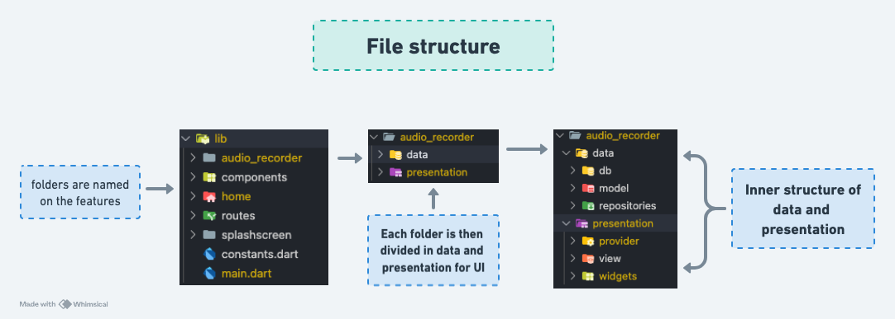
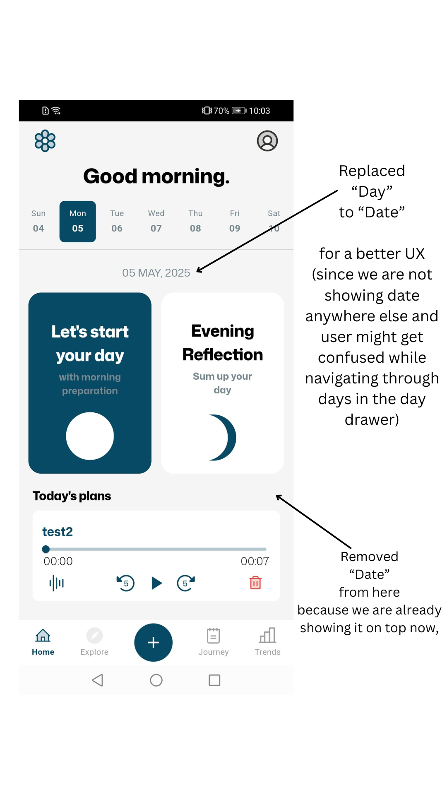

# Audio Journal App

Audio Journal is a cross-platform Flutter application that lets users record, save, and revisit their daily goals through voice journaling. Designed for personal growth, it offers an intuitive interface and local audio storage.

## Download APK file from Google Drive 📥

[](https://drive.google.com/drive/folders/1ZBxK4timheVkNNsx5rEtqf1gLIcfEnRJ?usp=sharing)

---

## Features

- Record and replay daily voice journals.
- View and filter past recordings.
-  Clean and responsive UI.

## Setup Instructions

### Prerequisites

- Flutter 3.22.1
- Dart 3.4.1

### Packages used
```bash
dependencies:
  flutter:
    sdk: flutter
  flutter_svg: ^2.1.0
  flutter_screenutil: ^5.9.3
  intl: ^0.20.2
  provider: ^6.1.5
  sqflite: ^2.3.2
  audio_waveforms: ^1.3.0
  path_provider: ^2.1.5
  uuid: ^4.5.1
  just_audio: ^0.9.46
```

### Clone the Repository
```bash
git clone https://github.com/YOUR_GITHUB_USERNAME/audio-journal.git
cd audio-journal
```

### Install Dependencies
```bash
flutter pub get
```

### Run the Application
```bash
flutter run
```


## Project structure


## Screen recording of the app flow
[](https://youtube.com/shorts/30D0DAFxXNo)

## Additional notes


---

### Contributions
All credits go to @anujjainwork (Github profile)
---
